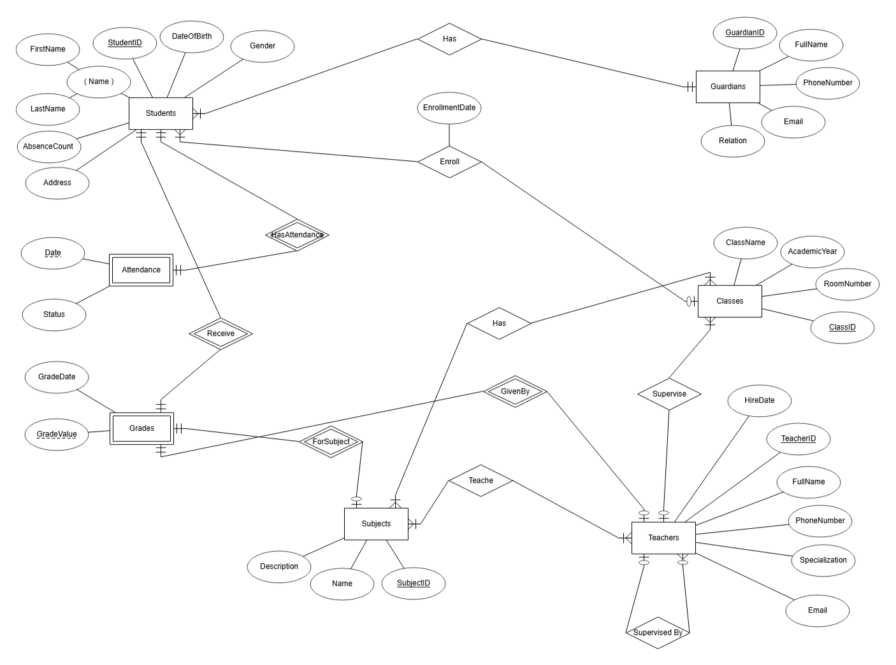

# 🎓 School Management Database Project

This project is a **relational database system** for managing a school's core data using **Microsoft SQL Server**. It covers students, teachers, subjects, grades, classes, guardians, and attendance tracking with **advanced SQL features** like triggers, functions, views, and indexes.

---

## 🧱 Entity-Relationship Diagram (ERD)



---

## 🔁 Mapping (ERD to Tables)

This project includes a full **mapping diagram** that shows how the ERD was translated into normalized SQL tables:


### Includes:

- Table structures with primary and foreign keys
- Enum conversions into `CHECK` constraints
- Many-to-many bridge tables (e.g., `TeacherSubject`, `ClassSubject`, `TeacherClass`)

---

## ⚙️ Features

- Students are linked to classes and guardians
- Teachers are assigned to subjects and can supervise other teachers
- Classes are connected to multiple subjects and homeroom teachers
- Tracks student attendance with statuses: `Present`, `Absent`, `Late`
- Grades are recorded per student, per subject, per teacher
- Includes many-to-many relationships:
  - ✅ Class–Subject
  - ✅ Teacher–Subject
  - ✅ Teacher–Class
- Uses constraints, default values, and enum-style validations

---

## 💡 Advanced SQL Logic

The project implements advanced database techniques to ensure performance, automation, and clean logic separation:

### ✅ Triggers

- `trg_AttendanceValidation`: Automatically increases a student's absence count if marked `Absent`, and prevents inserting future-dated attendance.
- `trg_PreventDeletingTeacher`: Blocks deleting teachers who are still linked to subjects.

### ✅ Functions

- `fn_GetMonthlyAbsences`: Returns how many times a student was absent in a specific month.
- `fn_GetStudentAverageGrade`: Returns the average grade of a student.

### ✅ Views

- `vw_StudentAttendanceSummary`: Shows how many times each student was present, absent, or late.
- `vw_StudentGrades`: (Optional) Shows detailed grades with subject and teacher info.

### ✅ Indexes

- On `Attendance(StudentID, Date)` to speed up filtering by student/date.
- On `Grades(StudentID, SubjectID)` to speed up grade lookups.
- On `Teachers(Specialization)` for faster filtering by subject area.

---

## 🗃️ Project Structure

```bash
📦 SchoolDB
 ┣ 📁 sql
 ┃ ┣ 📄 create_tables.sql         # All CREATE TABLE + constraints
 ┃ ┣ 📄 insert_data.sql           # Sample data
 ┃ ┣ 📄 triggers.sql              # All triggers used
 ┃ ┣ 📄 functions.sql             # Scalar functions
 ┃ ┣ 📄 views.sql                 # Reusable SELECTs
 ┃ ┣ 📄 indexes.sql               # Indexes for performance
 ┃ ┗ 📄 test_queries.sql          # Queries to test logic
 ┣ 📁 docs
 ┃ ┣ 🖼️ ERD.png
 ┃ ┗ 🖼️ mapping.png
 ┗ 📄 README.md
```

---

### 🧪 Sample SQL Queries

- All sample queries are available in test_queries.sql and include:
- Get students with their guardians and class
- Check student attendance summary
- Show average grade per student
- Query teachers by specialization
- Analyze monthly absences for one student
- Prevent invalid inserts via trigger testing

---

---

### 🏁 How to Use

- Run create_tables.sql in SQL Server Management Studio
- Run insert_data.sql to seed the database
- Run the logic files (triggers.sql, functions.sql, etc.)
- Use test_queries.sql to validate all features

---

---

### 🛠 Built With

- SQL Server 2019+
- ERDPlus for ER
- dbdiagram.io for Mapping diagrams
- GitHub for version control

---

> 🎉 Maintained by **Mostafa Adly**
